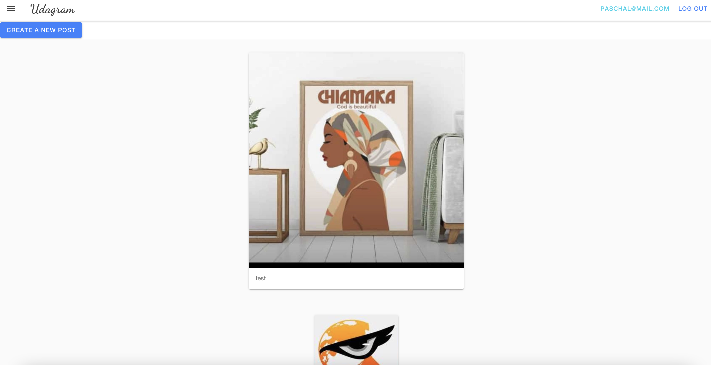
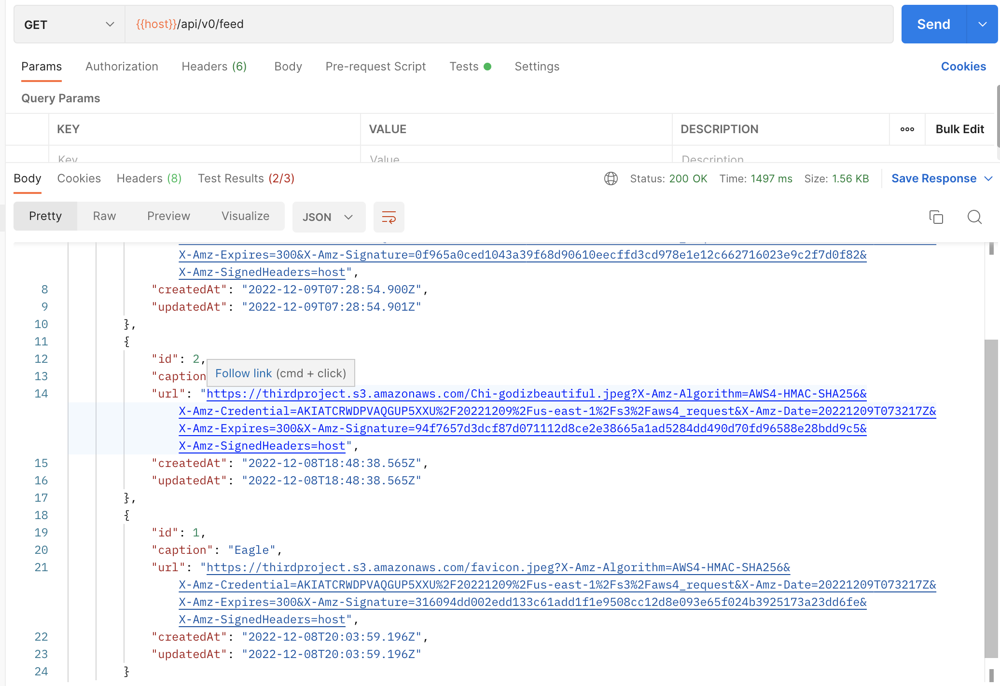
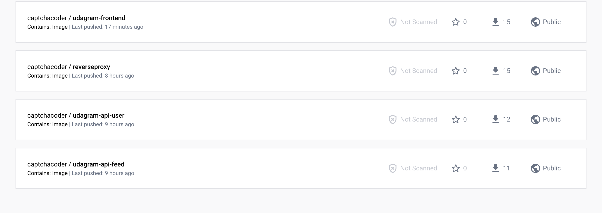
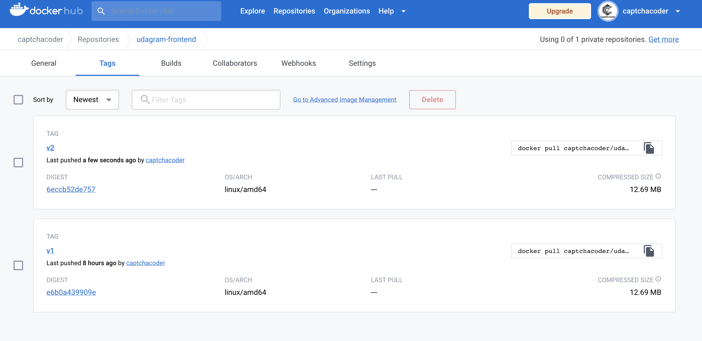
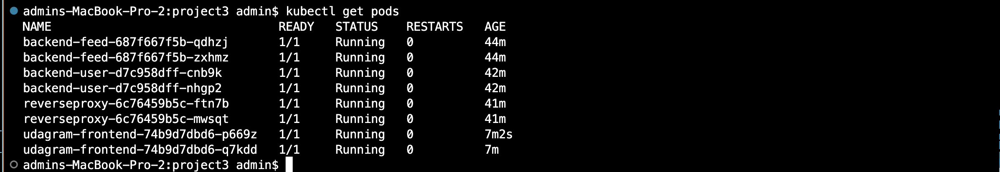
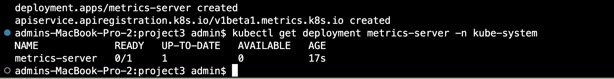
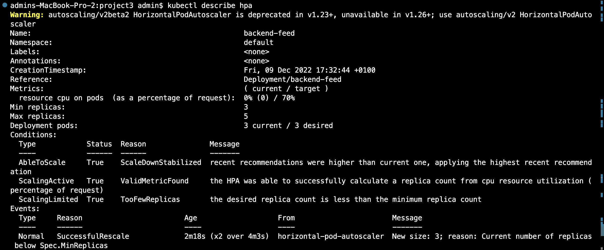
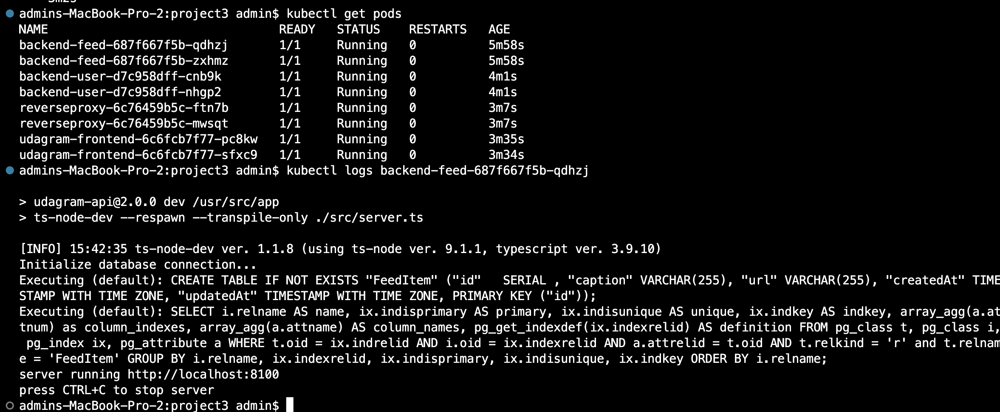
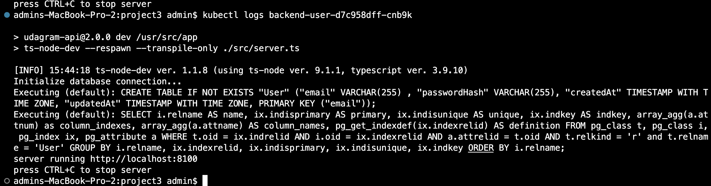

# Udacity's Udagram Image Filtering Application
## Refactory Monolith to Microservices
** (Note: This version doesn't include any CI (you can include Circle CI, Travis or Git Actions for continious integration, check my other repo for CI version)

Udagram is a simple cloud application developed alongside the Udacity Cloud Developer Nanodegree. It allows users to register and log into a web client, post photos to the feed, and process photos using an image filtering microservice.
In this project, I had to refactor a monolithic application (Image filtering Angular web App) into microservices and then deploy it to an EKS Cluster. Note that AWS resources were used such as EKS, S3, RDS(Postgres), IAM, 


The project is split into two parts:
1. Frontend - Angular web application built with Ionic Framework
2. Backend RESTful API - Node-Express application

## Getting Started
> _tip_: it's recommended that you start with getting the backend API running since the frontend web application depends on the API.

### Prerequisite
1. The depends on the Node Package Manager (NPM). You will need to download and install Node from [https://nodejs.com/en/download](https://nodejs.org/en/download/). This will allow you to be able to run `npm` commands.
2. Environment variables will need to be set. These environment variables include database connection details that should not be hard-coded into the application code.

### Successful Deployment
*** Screenshots showing interaction with the app ***



### Deployment Pipeline
***DockerHub showing containers that you have pushed***

<br>


### Kubernetes
*** Verifies Kubernetes pods are deployed properly ***
```bash
kubectl get pods
```


### Autoscale pods
***Verifies that horizontal scaling is set against CPU usage***
P.S. a metrics server had to be installed
```bash
kubectl describe hpa
```



### Backend Activity logs
***Verifies logging is set up with a backend application***
```bash
kubectl logs {pod_name}
```



